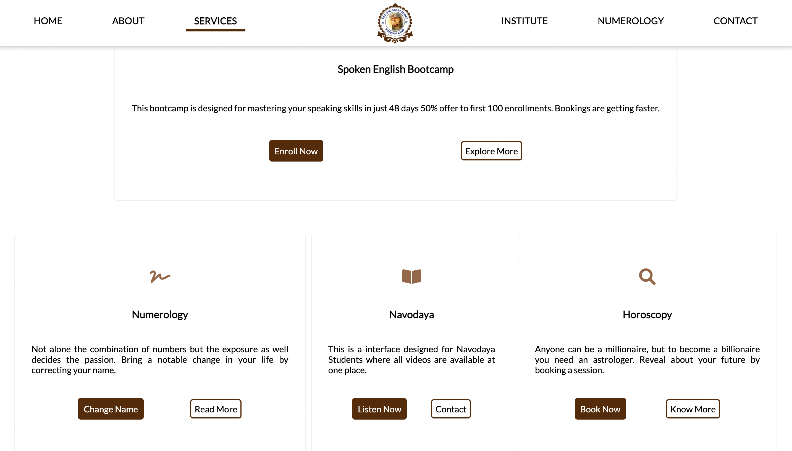
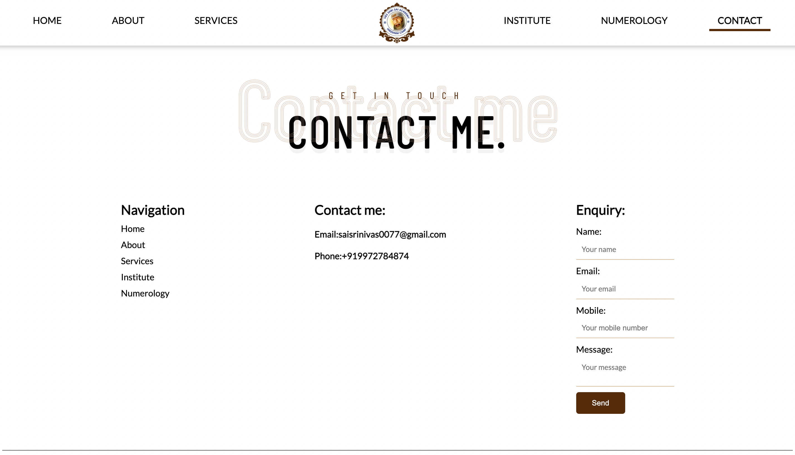
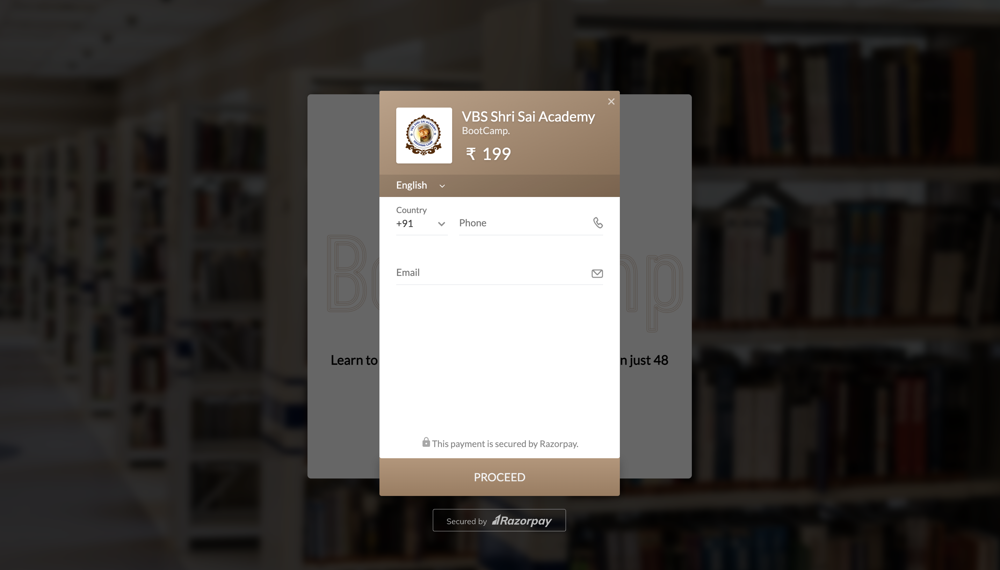

# VBS Shri Sai Academy

 
 
  

   
   

This is a website build for a Educational academy named VBS Shri Sai Tutorials, completely server side rendered website written in NodeJS & MongoDB.

- Everything is dynamically rendered from a DB based on client need except the static home page.
- Includes a simple Youtube clone to watch tutorials of VBS Academy.
- Also Includes fully secure and safe payment gateway integration of RazorPay.

## 

# Preview

|                                          |                                          |
| ---------------------------------------- | ---------------------------------------- |
|  |  |
|  |  |

--------------------------------------------------------------------------------------------------------------------------------------------------------------------
  
 
 
 ## ✍🏽 Author: KODAM KARTHIK
